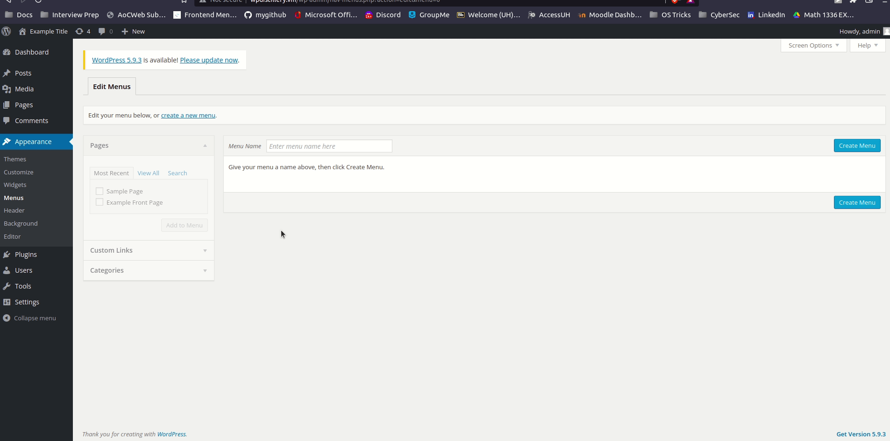

# Project 7/8 - WordPress Vulnerabilities

## Report

### 1. Title: WordPress Version 2.5-4.6 - Authenticated Stored Cross-Site Scripting via Image Filename (CVE-2016-7168)
  - [ ] Summary: An attacker can create a specially crafted image file name which, when uploaded in WordPress, injects malicious JavaScript code into the application.
   
    - Vulnerability types: XSS
    - Tested in version: 4.2
    - Fixed in version: 4.2.1
    
  - [ ] GIF Walkthrough: 
  - [ ] Steps to recreate: You need to be an admin to create a title post containing the harmful attachment name with script which is included below. Once posted, on refresh of the page an alert from the malicious script is triggered.

    `cengizhansahinsumofpwn.jpg`

  - [ ] Sources Used: 
    - [Link 1](https://sumofpwn.nl/advisory/2016/persistent_cross_site_scripting_vulnerability_in_wordpress_due_to_unsafe_processing_of_file_names.html)

### 2. Title: WordPress Version <= 4.2.3 Nav Menu Title Cross-Site Scripting (CVE-2015-5733)
  - [ ] Summary: Cross-site scripting (XSS) vulnerability in the refreshAdvancedAccessibilityOfItem function in wp-admin/js/nav-menu.js in WordPress before 4.2.4 allows remote attackers to inject arbitrary web script or HTML via an accessibility-helper title.
  
    - Vulnerability types: XSS
    - Tested in version: 4.2
    - Fixed in version: 4.2.4
    
  - [ ] GIF Walkthrough: 
  - [ ] Steps to recreate:
      - Sign in as admin
      - Go to dashboard
      - Click appearance then menu
      - Create a new menu, in customs links input the affected code below 
      - Save menu and refresh page
      
  - [ ] Affected source code:
     `Home)`
     
 ### 3. Title: WordPress Version < 4.7.5 Large File Upload Cross-Site Scripting (CVE-2017-9061)
  - [ ] Summary: In WordPress before 4.7.5, a cross-site scripting (XSS) vulnerability exists when attempting to upload very large files, because the error message does not properly restrict presentation of the filename.
  
    - Vulnerability types: XSS
    - Tested in version: 4.2
    - Fixed in version: 4.2.4
    
  - [ ] GIF Walkthrough: 
  - [ ] Steps to recreate:
      - Create file greater than 20mb
      - Rename file with ending extension of code below
      - As admin go to dashboard then media upload
      - Upload the affected name changed file
      
  - [ ] Affected source code:
     `.jpg`
